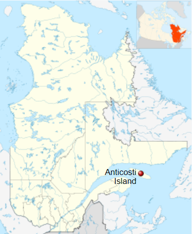

# **After the storm: Community composition and diversity shifts after a hemlooper looper outbreak (*Lambdina fiscellaria*) on Anticosti Island, 1973**


#### Living Data Project - Maxime Fraser Franco (UQAM) and Victoria Marie Glynn (McGill)

Using real data from a devastating pest outbreak in Québec, we will begin to explore how **disturbance** in ecological communities impact:

- community composition
- diversity metrics
- species abundance curves

--------------------------------------------------------------------------------------------------------------------------------------------

When you think of predator-prey interactions, what comes to mind? Perhaps it is the emblematic hare and lynx example from the [Hudson's Bay Company pelt-trading dataset](https://jckantor.github.io/CBE30338/02.05-Hare-and-Lynx-Population-Dynamics.html), or footage from nature documentaries that show lions hunting zebras. But predator-prey interactions are often less conspicuous, and still strongly impact ecological communities. A great example are insect pests and their plant prey. In this tutorial, we are going to explore an instance of this interaction on Anticosti Island, Québec, between the hemlooper looper (*Lambdina fiscellaria*) and the trees it predates upon, and how this can reverberate throughout the greater beetle and lepidoptera community. 

<center>




</center>


```{r setup, include=FALSE} 
knitr::opts_chunk$set(echo = TRUE)
```

## **0. What happened?** 

[insert before and after pictures]
[talk about degree of damage]
[link follow-up papers on the area]


------------------------------------------------------------------------------

## **1. Getting to know our data**

### Let us begin by loading in the two datasets: 

#### First, let us call in the tree composition dataset, which we will call 'tree'


```{r, echo = TRUE}
tree <- read.csv("anticosti_1973_trees.csv", header = TRUE) 
```


#### Next, let us call in the beetle and lepidoptera biodiversity dataset, which we will call 'insect' 


```{r, echo = TRUE}
insect <- read.csv("microsigebready_carabeslepidoptera_anticosti_1993_en.csv", header = TRUE) 
```

Before beginning our analyses, it is great practice to quickly inspect the data and ask ourselves, is all the information we are looking for there? 

To do that, there are a handful of commands we can use: 

[also mention data structure, plot, compt, etc]
-----------------------------------------------------------------

A quick first visualization we can do is to see the tree diversity per compartment:

```{r}
##diversity of trees per compartment 

library(ggplot2)

treediv <- ggplot(tree, aes (y=Number, x=Compartment, fill = Species_abbrev)) + 
    geom_bar(position="stack", stat="identity")

treediv

```

We can further customize the plot to make it more colorblind friendly

```{r}
##Further customize tree plot

library(ggplot2)
library(viridis)
library(hrbrthemes)

cbPalette <- c("#999999", "#E69F00", "#56B4E9", "#009E73", "#F0E442", "#0072B2", "#D55E00", "#CC79A7")

treediv_cus <- treediv +  scale_fill_manual(values=cbPalette) + 
    ggtitle("Tree species across compartments, during hemlock looper outbreak in 1973") +
    xlab("Compartment") + ylab ("Count of species") + scale_fill_discrete(name = "Tree species")


treediv_cus

ggsave("treediv_cus.png", width = 10, height = 5)

```

We can then move up one level of organization, and consider tree diversity per plot. Using the code above, how would you run these commands using ggplot?

```{r, echo = FALSE, message = FALSE, warning = FALSE}
##diversity of trees per block

tree_bloc <- ggplot(tree, aes (y=Number, x=Block, fill = Species_abbrev)) + 
    geom_bar(position="stack", stat="identity")

tree_bloc
```

```{r, echo = FALSE, message = FALSE, warning = FALSE}
tree_bloc2 <- tree_bloc + scale_fill_manual(values=cbPalette) + 
    ggtitle("Tree species across blocks, during hemlock looper outbreak in 1973") +
    xlab("Block") + ylab ("Count of species") + scale_fill_discrete(name = "Tree species")

tree_bloc2

ggsave("tree_bloc2.png", width = 10, height = 5)
```

As we know these trees were sampled during a hemlock looper outbreak, we can now ask: how were different tree species affected?

```{r}
## Differences in tree condition per plot

##diversity of trees per compartment 

treecon <- ggplot(tree, aes (y=Number, x=Species_abbrev, fill = Condition)) + 
    geom_bar(position="stack", stat="identity")

treecon

```
```{r}

cbPalette <- c("#999999", "#E69F00", "#56B4E9", "#009E73", "#F0E442", "#0072B2", "#D55E00", "#CC79A7")

treecon_2 <- treecon + scale_fill_manual(values=cbPalette) + 
    ggtitle("Tree condition across species, during hemlock looper outbreak in 1973") +
    xlab("Species") + ylab ("Count of species") + scale_fill_discrete(name = "Tree condition")

treecon_2

ggsave("treecon_2.png", dpi = 320)
```

-------------------------------------------------------------------------------

## **2. Species accumulation curves**

[intro value species accumulation curves]

Although these curves recapitulate a general characteristic of ecological community, 

- general characteristics
- assumptions? 

BIG ONE HERE is that we can obtain a count of all the species present > sampling effort

Is it reasonable to have been able to count all species on Anticosti Island, in a given 400 m^2 plot? 

[Paper] (https://besjournals.onlinelibrary.wiley.com/doi/10.1046/j.1365-2656.2003.00748.x)

```{r, echo = FALSE, message = FALSE, warning = FALSE}

### Full dataset, regardless tree condition

df_all = subset(tree, select = -c(Page,Management_unit,Trip,Compartment,Plot,Photo,Length_foot,Width_foot,Area_m2,Date,Person_notes,Cell,Species,Person_instrument))

df_all
```

```{r, echo = FALSE, message = FALSE, warning = FALSE}

library(dplyr)
library(tidyr)

block_all<- df_all %>%
  group_by(Block, Species_abbrev) %>%
  tally() %>%
  spread(Species_abbrev, n, fill = 0)

block_all
```

```{r, echo = FALSE, message = FALSE, warning = FALSE}
library(vegan)


block_all$Block <- as.numeric(block_all$Block)

block_all

```


```{r}
sp2a_full <- specaccum(block_all, "random")

sp2a_full

plot(sp2a_full$sites, sp2a_full$richness, xlab="Number of Sites",ylab="Species Richness", main="Tree species accumulation curve, Anticosti Island 1973")


```

```{r, echo = FALSE, message = FALSE, warning = FALSE}

library(vegan)
library(tibble)

### only keep trees condition = good

good_trees <- tree[tree$Condition == "Good",]

good_trees

df = subset(good_trees, select = -c(Page,Management_unit,Trip,Compartment,Plot,Photo,Length_foot,Width_foot,Area_m2,Date,Person_notes,Cell,Species,Person_instrument))

df

```

```{r, echo = FALSE, message = FALSE, warning = FALSE}
library(dplyr)
library(tidyr)

block_condition <- df %>%
  group_by(Block, Species_abbrev) %>%
  tally() %>%
  spread(Species_abbrev, n, fill = 0)

block_condition
```
```{r}
library(plyr)

ddply(block_condition,~Block,function(x) {
+  data.frame(RICHNESS=sum(x[-1]>0))
})

```

```{r, echo = FALSE, message = FALSE, warning = FALSE}
library(vegan)


block_condition$Block <- as.numeric(block_condition$Block)

block_condition 

```

```{r}
sp2a <- specaccum(block_condition, "random")

sp2a

plot(sp2a$sites, sp2a$richness,   xlab="Number of Sites",ylab="Species Richness", main="Tree species accumulation curve, trees with good condition - Anticosti Island 1973")
```

The variability in the shape of SACs is primarily due to variations in the catchable/trappable fauna assemblage structure, which can occur due to variations in ambient temperature, and among seasons and from year-to-year 

Strange dip, what do you think it means? Impact of some sites more heavily affected

```


