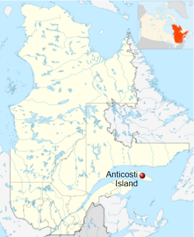
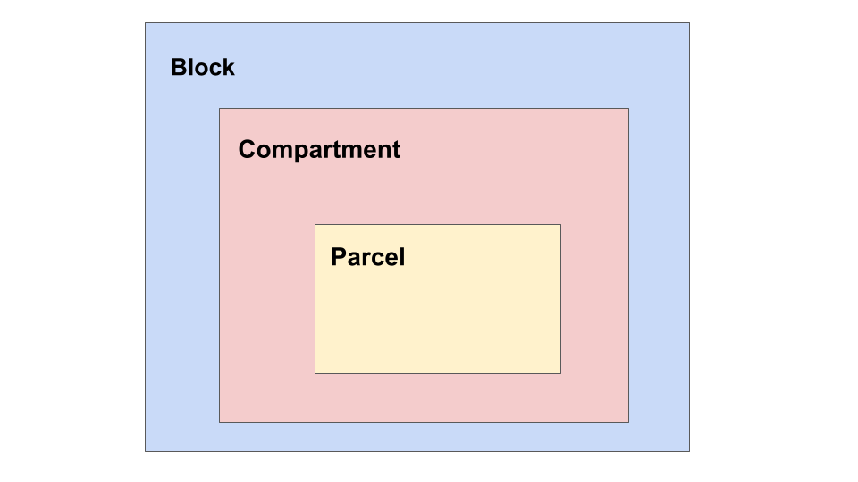

# **After the storm: Community composition and diversity shifts after a hemlooper looper outbreak (*Lambdina fiscellaria*) on Anticosti Island, 1973**


#### Living Data Project - Maxime Fraser Franco (UQAM) and Victoria Marie Glynn (McGill)

## Using real data from a devastating pest outbreak in Québec, we will begin to explore how **biological invasions** impact ecological communities. 

--------------------------------------------------------------------------------------------------------------------------------------------

### When you think of predator-prey interactions, what comes to mind? Perhaps it is the emblematic hare and lynx example from the [Hudson's Bay Company pelt-trading dataset](https://jckantor.github.io/CBE30338/02.05-Hare-and-Lynx-Population-Dynamics.html), or footage from nature documentaries that show lions hunting zebras. But predator-prey interactions are often less conspicuous, and still strongly impact ecological communities. A great example are insect pests and their plant prey. In this tutorial, we are going to explore an instance of this interaction on Anticosti Island, Québec, between the hemlooper looper (*Lambdina fiscellaria*) and the trees it predates upon, and how this can reverberate throughout the greater beetle and lepidoptera community. 

<center>




</center>


```{r setup, include=FALSE} 
knitr::opts_chunk$set(echo = TRUE)
```

# **0. What happened?** 

[insert before and after pictures]

[talk about degree of damage]

[link follow-up papers on the area]

Their sampling approach was as follows: 

- The forest was divided into various blocks
- Each block was further subdivided into compartments
- The compartments are composed of parcels, each 400 m^2

<center>

</center>

#### For this tutorial, we will focus on the largest category, the block level. 

#### Given the hemlock looper was such an aggressive pest, our task today is to determine:

<br> 
<br> 
<center>
#### **(1) Did the hemlock looper attack trees at random?**
#### or 
#### **(2) Does the hemlock looper preferentially attack some trees?**
</center>
<br> 
<br> 

### Based on what you find, we will ask you to provide some management strategies, as the hemlock looper is still an issue in Québec's forests. 

------------------------------------------------------------------------------
<center>
# **1. How was the tree community impacted during the outbreak?**


```{r, echo = FALSE, message = FALSE, warning = FALSE, include = FALSE}
tree <- read.csv("anticosti_1973_trees.csv", header = TRUE) 
```

## 1a. Before answering this question, we need to understand how different tree species are spread out across the various blocks:

```{r, echo = FALSE, message = FALSE, warning = FALSE, include = FALSE}
##Further customize tree plot

library(ggplot2)
library(viridis)
library(hrbrthemes)


cbPalette <- c("#999999", "#E69F00", "#56B4E9", "#009E73", "#F0E442", "#0072B2", "#D55E00", "#CC79A7")

##diversity of trees per block

tree_bloc <- ggplot(tree, aes (y=Number, x=Block, fill = Species_abbrev)) + 
    geom_bar(position="stack", stat="identity")

tree_bloc

tree_bloc2 <- tree_bloc + scale_fill_manual(values=cbPalette) + 
    ggtitle("Tree species across blocks, during hemlock looper outbreak in 1973") +
    xlab("Block") + ylab ("Count of species") + scale_fill_discrete(name = "Tree species")
```

```{r, echo = FALSE, message = FALSE, warning = FALSE}
tree_bloc2
```

<br>

### From looking at this plot: 

#### (1) Which tree is the most abundant species across all our blocks? 

#### (2) Which tree is the least abundant species across all our blocks? 

<br>

## 1b. Now, let us see how different trees were affected due to the hemlock

```{r, echo = FALSE, message = FALSE, warning = FALSE, include = FALSE}
## Differences in tree condition per plot

##diversity of trees per compartment 

treecon <- ggplot(tree, aes (y=Number, x=Species_abbrev, fill = Condition)) + 
    geom_bar(position="stack", stat="identity")

treecon

cbPalette <- c("#999999", "#E69F00", "#56B4E9", "#009E73", "#F0E442", "#0072B2", "#D55E00", "#CC79A7")

treecon_2 <- treecon + scale_fill_manual(values=cbPalette) + 
    ggtitle("Tree condition across species, during hemlock looper outbreak in 1973") +
    xlab("Species") + ylab ("Count of species") + scale_fill_discrete(name = "Tree condition")

```

```{r, echo = FALSE, message = FALSE, warning = FALSE}
treecon_2
```
</center>


