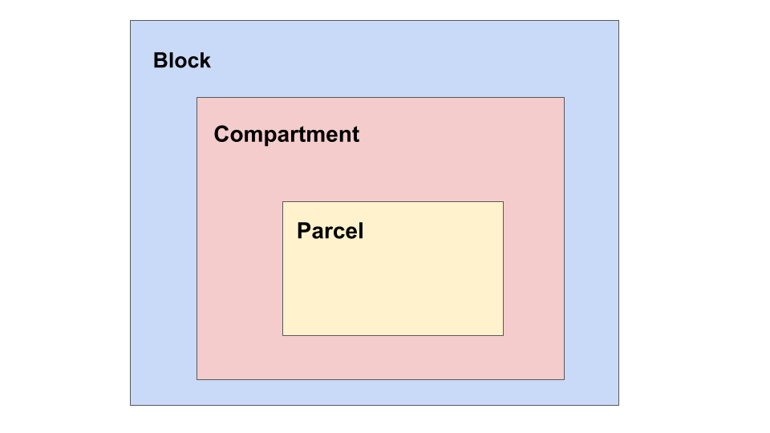
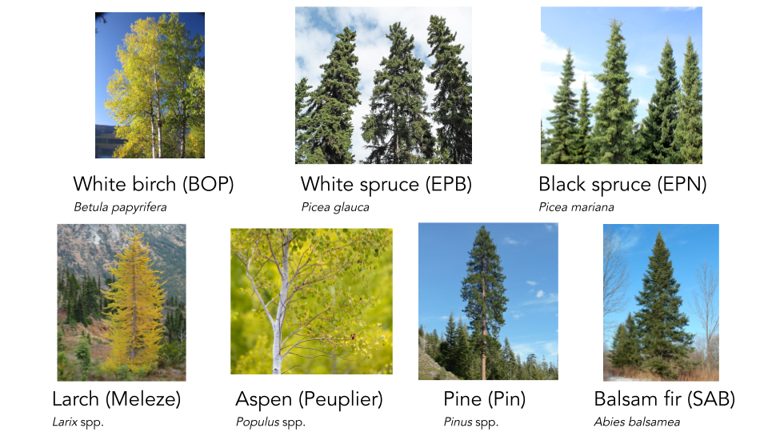
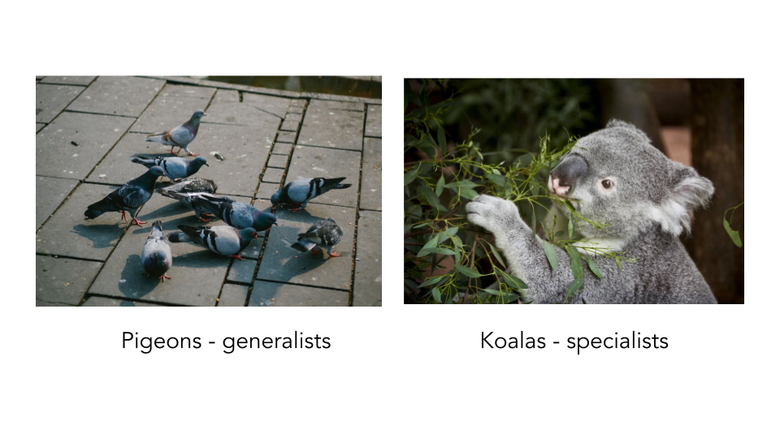

---
title: "After the storm: Impacts of a hemlock looper (*Lambdina fiscellaria*) outbreak on tree species in Anticosti Island, 1973"
author: "Living Data Project - Victoria Marie Glynn (McGill) and Maxime Fraser Franco (UQAM)"
date: "`r format(Sys.time(), '%d %B, %Y')`"
output:
  #github_document: default
  html_document:
    toc: true
    toc_float: true
    number_sections: true
runtime: shiny_prerendered
---

**Using real data from a devastating pest outbreak in Québec, we will begin to explore how biological invasions impact ecological communities.**

--------------------------------------------------------------------------------------------------------------------------------------------

Start by giving some context/background on Anticosti to emphazise why it is important...

When you think of predator-prey interactions, what comes to mind? Perhaps it is the emblematic hare and lynx example from the [Hudson's Bay Company pelt-trading dataset](https://jckantor.github.io/CBE30338/02.05-Hare-and-Lynx-Population-Dynamics.html), or footage from nature documentaries that show lions hunting zebras. But predator-prey interactions are often less conspicuous, and still strongly impact ecological communities. A great example are insect pests and their plant prey. In this tutorial, we are going to explore an instance of this interaction on Anticosti Island, Québec, between the hemlooper looper (*Lambdina fiscellaria*) and the trees it predates upon. 

------------------------------------------------------------------------------

<center>

 

</center>


```{r setup, include = FALSE} 
knitr::opts_chunk$set(echo = TRUE)
```

# What happened? 

[insert before and after pictures]

[talk about degree of damage]

[link follow-up papers on the area]

Their sampling approach was as follows: 

- The forest was divided into various blocks
- Each block was further subdivided into compartments
- The compartments are composed of parcels, each 400 m^2

<center>

</center>


# Learning objectives 

**Given the hemlock looper was such an aggressive pest, our task today is to determine:**

 1. **What is the tree species composition of the Anticosti Island?**
 2. **Does the hemlock looper preferentially attack some trees or instead multiple trees?**
 3. **Does the hemlock looper attack specific trees because they are more abundant?**
 
**Based on what you find, we will ask you to provide some management strategies, as the hemlock looper is still an issue in Québec's forests.**

------------------------------------------------------------------------------
<center>

# Setting up our R session

Let's start by loading some packages we will use for our analyses
```{r, message = FALSE, warning = FALSE}
library(data.table)
library(ggplot2)
library(tidyverse)
library(viridis)
library(learnr)
library(dplyr)
```

Then, we import the data in the current R session
```{r, message = FALSE, warning = FALSE}
# Tree condition data url paths
url_tree <- "https://open.canada.ca/data/en/dataset/9dda09b0-649f-4002-b207-7b204eb81cbb/resource/a1606235-95aa-4c81-a8db-19b852be288c"
csv_tree <- "download/anticosti_1973_trees.csv"

# Import the data and keep the data we need
tree <- fread(file.path(url_tree, csv_tree),
              select = c("Block", "Compartment", "Plot",
                         "Cell", "Species", "Species_abbrev",
                         "Condition", "Number"))

# Separate row number in instances to have all individual counts
tree <- tree[rep(seq(.N), Number)]
tree[, Number := 1]
```

# Describing Anticosti Island's tree community composition

## What trees were identified?

```{r, echo = FALSE, message = FALSE, warning = FALSE}

# Prepare some plot customizations
cbPalette <- c("#999999", "#E69F00", "#56B4E9", "#009E73",
               "#F0E442", "#0072B2", "#D55E00", "#CC79A7")

# Diversity of trees 

## Relative frequency of tree species

tree_rel <- tree %>%
  group_by(Species_abbrev) %>%
  summarise(n = n()) %>%
  mutate(freq = n / sum(n))

tree_rel
```
```{r, echo = FALSE, message = FALSE, warning = FALSE, include = FALSE}

tree_bloc <- ggplot(tree_rel, aes (y = freq, x = "", fill = Species_abbrev)) + 
    geom_bar(position = "stack", stat = "identity")

tree_bloc

tree_bloc2 <- tree_bloc + scale_fill_manual(values=cbPalette) + 
    ggtitle("Tree species identified during hemlock looper outbreak in 1973") +
    xlab("") + 
    ylab ("Relative proportion\n") +
    scale_fill_discrete(name = "Tree species")
```

```{r, echo = FALSE, message = FALSE, warning = FALSE}
tree_bloc2
```


From this plot, we see that seven different taxa were identified, with their respective abbreviation from the dataset shown in parentheses:

1. White birch (BOP) - *Betula papyrifera*
2. White spruce (EPB) - *Picea glauca*
3. Black spruce (EPN) - *Picea mariana*
3. Larch (Meleze) - *Larix* spp.
4. Aspen (Peuplier) - *Populus* spp.
5. Pine (Pin) - *Pinus* spp.
6. Balsam fir (SAB) - *Abies balsamea*

<center>


</center>


**From looking at this plot:** 

```{r checkbox-a, echo=FALSE}
question("What tree species is the most abundant in the data? Select all that apply",
  answer("White birch (BOP) - *Betula papyrifera*"),
  answer("White spruce (EPB) - *Picea glauca*"),
  answer("Black spruce (EPN) - *Picea mariana*"),
  answer("Larch (Meleze) - *Larix* spp."),
  answer("Aspen (Peuplier) - *Populus* spp."),
  answer("Pine (Pin) - *Pinus* spp."),
  answer("Balsam fir (SAB) - *Abies balsamea*", correct = TRUE)
)
```

```{r checkbox-b, echo=FALSE}
question("What tree species is the least abundant in the data? Select all that apply.",
  answer("White birch (BOP) - *Betula papyrifera*"),
  answer("White spruce (EPB) - *Picea glauca*"),
  answer("Black spruce (EPN) - *Picea mariana*"),
  answer("Larch (Meleze) - *Larix* spp.", correct = TRUE),
  answer("Aspen (Peuplier) - *Populus* spp.", correct = TRUE),
  answer("Pine (Pin) - *Pinus* spp.", correct = TRUE),
  answer("Balsam fir (SAB) - *Abies balsamea*")
)
```

<br>

# How were different tree species impacted by hemlock looper?

```{r, echo = FALSE, message = FALSE, warning = FALSE, include = FALSE}

# Differences in tree condition per plot

# Diversity of trees per compartment 

tree_damage <- tree %>%
  group_by(Species_abbrev, Condition) %>%
  summarise(n = n()) %>%
  mutate(freq = n / sum(n))

tree_damage

treecon <- ggplot(tree_damage, aes (y = freq, x = Species_abbrev, fill = Condition)) + 
    geom_bar(position = "stack", stat = "identity")

treecon

treecon_2 <- treecon + scale_fill_manual(values=cbPalette) + 
    ggtitle("Tree condition across species, during hemlock looper outbreak in 1973") +
    xlab("\nSpecies") +
    ylab ("Relative proportion\n") +
    scale_fill_discrete(name = "Tree condition")

```

```{r, echo = FALSE, message = FALSE, warning = FALSE}
treecon_2
```

**From looking at this plot:** 

```{r checkbox-c, echo=FALSE}
question("What tree species was **MOST** affected by the hemlock looper? Select all that apply.",
  answer("White birch (BOP) - *Betula papyrifera*"),
  answer("White spruce (EPB) - *Picea glauca*"),
  answer("Black spruce (EPN) - *Picea mariana*"),
  answer("Larch (Meleze) - *Larix* spp."),
  answer("Aspen (Peuplier) - *Populus* spp."),
  answer("Pine (Pin) - *Pinus* spp."),
  answer("Balsam fir (SAB) - *Abies balsamea*", correct = TRUE)
)
```

```{r checkbox-d, echo=FALSE}
question("What tree species was **LEAST** affected by the hemlock looper? Select all that apply.",
  answer("White birch (BOP) - *Betula papyrifera*"),
  answer("White spruce (EPB) - *Picea glauca*"),
  answer("Black spruce (EPN) - *Picea mariana*"),
  answer("Larch (Meleze) - *Larix* spp.", correct = TRUE),
  answer("Aspen (Peuplier) - *Populus* spp.", correct = TRUE),
  answer("Pine (Pin) - *Pinus* spp.", correct = TRUE),
  answer("Balsam fir (SAB) - *Abies balsamea*")
)
```
These two previous plots beg the following question: were hemlock loopers attacking Balsam firs (SAB) because they are more abundant, or because this is their preferred prey? In other words, is this a **generalist** or **specialist** pest? What does this mean?

- A species is a **generalist** if it can live in a variety of environments and eat a variety of foods, meaning it is quite flexible in its diet and habitat requirements. 
- A species is a **specialist** if it has a limited diet, and stricter habitat requirements, meaning it cannot live anywhere and cannot eat anything. 

Two great examples are pigeons and koalas -- pigeons live in a diversity of urban environments and are omnivores (eat plant and animal matter), while koalas only live on and eat eucalyptus. 



With this in mind, let us run one more plot to gain some further insights:

# Does the hemlock looper attack tree species that are more abundant, or does it have a preferred tree species?

</center>

This question essentially asks us to consider the **relative proportion** of a given tree species, as it relates to the relative proportion of trees that were denoted as "dead." 

With this in mind, please answer the following question to help us draw predictions for our plot:


```{r letter-e, echo=FALSE}

question("What would you expect to see if a tree was most damaged by hemlock looper because it was more abundant?",
         answer("An increasing, straight line - one-to-one relationship, where having more trees means more damage will be detected*", correct = TRUE),
         answer("A decreasing, straight line - one-to-one relationship, where having less trees means more damage will be detected"),
         answer("A ... - what drives dynamics is tree species identity, and not that species' abundance")
 
)
```

Maxime's plots

**From the graph and  based on our predictions above, we can now answer the question:**
```{r letterx-d, echo=FALSE}
question("Do hemlock loopers preferentially attack a given tree species?",
  answer("Yes, because", correct = TRUE),
  answer("Yes, "),
  answer("No, because"),
  answer("No, because b")
)
```

# What do our findings imply in terms of pest management on Anticosti? 
