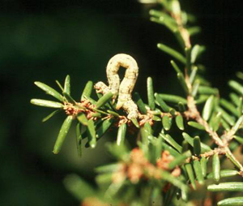
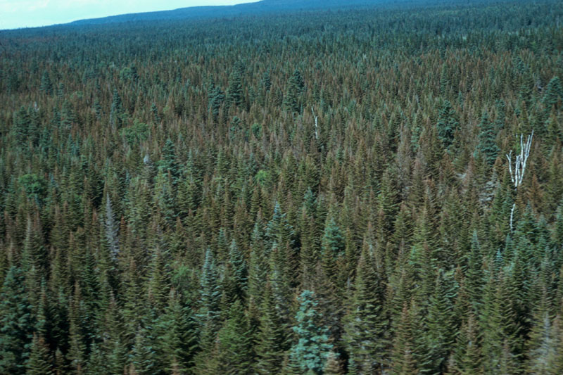
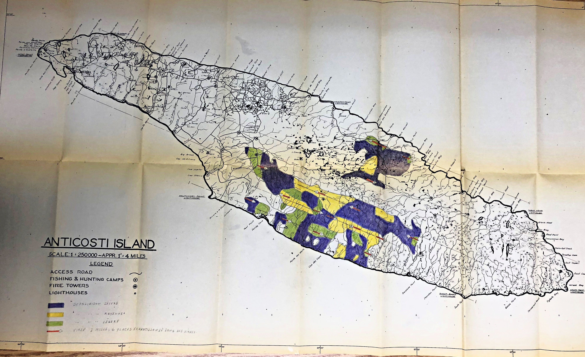
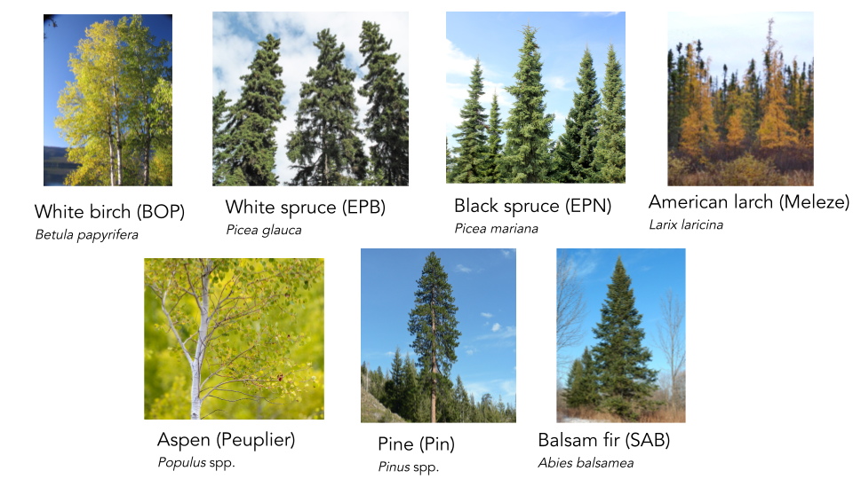
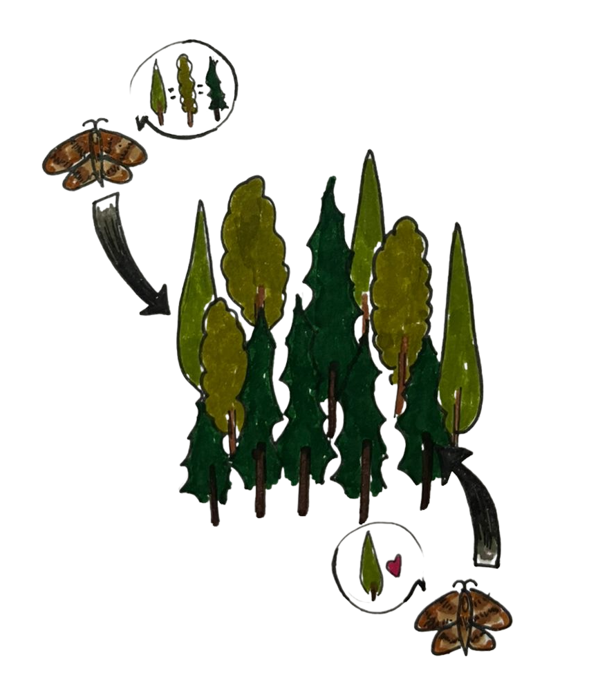
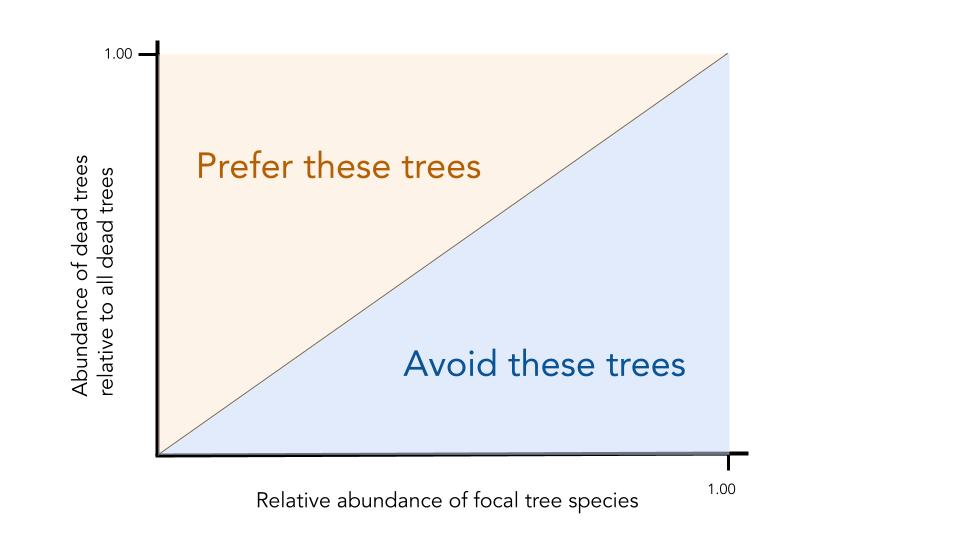

<style type="text/css">
  body{
  font-size: 13pt;
}
  p.caption {
    font-size: 0.8em;
}
</style>

```{r setup, include = FALSE}
library(learnr)
library(rsconnect)
knitr::opts_chunk$set(echo = TRUE,
                      message = FALSE,
                      warning = FALSE)
```

---------------------------------------------------------------------------------------

## Welcome to the Living Data Tutorials   {data-progressive=FALSE}

### The project

The Living Data Tutorials (LDTs) were developed by graduate students in ecology and evolution during the spring of 2022 as part of the Canadian Institute of Ecology and Evolution's ([CIEE](https://www.ciee-icee.ca/data.html)) Living Data Project (LDP). Our goal is to provide free and open-access teaching material in the form of online tutorials to undergraduate students in ecology and evolution.

All the tutorials make use of publicly available Canadian datasets to address specific topics in ecology and evolution. The following tutorial was built with the free and open-source [R](https://www.r-project.org/) programming language using the [leanr package](https://rstudio.github.io/learnr/). You can find the project folders and files in this [GitHub repository](https://github.com/Living-Data-Tutorials/Anticosti-Historical-Data).

We would like to thank [Anne Cotton-Gagnon](https://scf.rncan.gc.ca/employes/vue/acottong), MSc, and [Christian Hébert](https://cfs.nrcan.gc.ca/employees/read/chhebert), PhD, from Natural Resources Canada and the Laurentian Forestry Centre for their insights on the original datasets and access to the reports and maps associated with such.

### Developers

The present tutorial was developed by Victoria Marie Glynn who is a PhD student at McGill University in Montréal, Québec, and Maxime Fraser Franco who is a PhD student at the Université du Québec à Montréal (UQAM) in Montréal, Québec.

Please feel free to contact us if you have any question :

Victoria Marie Glynn - victoria.glynn@mail.mcgill.ca

Maxime Fraser Franco - fraser_franco.maxime@courrier.uqam.ca

<br>

```{r, echo = FALSE, out.width = "50%", fig.align = "left"}

```

---------------------------------------------------------------------------------------

## Learning objectives 

By the end of this tutorial, you will be able to : 

 - Interpret community ecology plots.
 - Differentiate between a generalist and specialist pest species, using community ecology plots.
 - Make data-driven management recommendations.

<br>

Our Anticosti Island tree dataset provides a unique opportunity for us to use **real and historical data** to gain skills in understanding what commonly made research plots, such as stacked bar plots, mean and how these figures can help us think more critically about natural resource management in Canada.

---------------------------------------------------------------------------------------

## What we will explore

When you think of predator-prey interactions, what comes to mind? Perhaps it is the emblematic hare and lynx example from the [Hudson's Bay Company pelt-trading dataset](https://jckantor.github.io/CBE30338/02.05-Hare-and-Lynx-Population-Dynamics.html), or footage from nature documentaries that showcase lions hunting zebras. But predator-prey interactions are often less conspicuous, and yet still strongly impact ecological communities. A great example are insect pests and their plant prey. Insect pests are an important source of economic losses in the agricultural and forest industries. It is thus crucial that we understand the ecology of these insects if we want to minimize their damages and predict when and where they will strike.

###

### Getting acquainted with our study system

In this tutorial, we are going to explore an instance of a predator-prey interaction between an insect and its tree hosts. We will investigate the case of a hemlooper looper (*Lambdina fiscellaria*) outbreak in Québec's Anticosti Island in 1973. The hemlock looper is a moth pest that is found [all across Canada](http://www.glfc.forestry.ca/VLF/ForumPresentations/heberthemlocklooper_08e.pdf), and parts of the USA, often as far south as the state of Georgia.

<br>

<style>
.html-widget {
    margin: auto;
}
</style>
```{r, echo = FALSE, out.width = "50%", fig.align = "center", fig.cap = "Anticosti Island, Québec, shown as a blue pin on a map of Eastern Canada and Northeastern United States of America"}

library(leaflet)
pacman::p_load(leaflet)
leaflet() %>%
  addTiles() %>%  # Add default OpenStreetMap map tiles
  addMarkers(lng= -63, lat= 49.5) %>%
  setView(-62, 48, zoom = 5)

```

<br>

```{r, echo = FALSE, out.width = "50%", fig.align = "center", fig.cap = "Photograph of a hemlock looper larvae, Maine Forest Service, Forest Health & Monitoring, Slide Collection"}

```

<br>

### What happened on Anticosti Island in 1973?

Since 1910, the hemlock looper has wreaked havoc in Québec's forests. Between 1910 and 1975, these outbreaks caused an estimated [24 million cubic meters of forest to be lost](https://fr.wikipedia.org/wiki/Lambdina_fiscellaria) in the province. Since then, additional outbreaks have occurred across Québec in places like Bas-Saint-Laurent, Gaspésie, and Anticosti Island. 

Since the first outbreak, the Ministry of Forests, Wildlife and Parks of Québec ([MFFP](https://mffp.gouv.qc.ca/?lang=en)) and the Society for the Protection of Forests against Insects and Diseases ([SOPFIM](https://sopfim.qc.ca/fr/)) have been monitoring hemlock looper outbreaks. The MFFP surveyed one of the most extensive tree mortality events due to a hemlock looper outbreak from [1971-1973](https://cfs.nrcan.gc.ca/pubwarehouse/pdfs/6856.pdf). As the hemlock looper larvae usually attacks mature tree stands by eating their leaves, it causes them to appear [yellow and red-brown in color](https://tidcf.nrcan.gc.ca/en/insects/factsheet/8846), a tell-tale sign that an outbreak has occurred. 

<br>

```{r, echo = FALSE, out.width = "50%", fig.align = "center", fig.cap = "Severely defoliated balsam fir forest due to a hemlock looper outbreak, photograph by Dr. Luc Jobin"}

```

<br>

While the outbreak was occuring, in 1973 Dr. Luc Jobin from the [Laurentian Forestry Centre](https://www.nrcan.gc.ca/science-and-data/research-centres-and-labs/forestry-research-centres/laurentian-forestry-centre/13473), and his student Michel Chabot (then going onto becoming a forester in MFFP) went to Anticosti Island to visually survey the degree of damage that the hemlock looper was causing. In their data, openly hosted on the [Government of Canada's website](https://open.canada.ca/data/en/dataset/9dda09b0-649f-4002-b207-7b204eb81cbb), they denoted a tree as either being "good," meaning it did not show any signs of damage from the outbreak, "dead" if the hemlock looper had attacked and killed the stand, and "questionable" if they were unsure. This historical, and yet still very relevant dataset, allows us to think about the impact pest outbreaks have on ecological communities.

<br>

```{r, echo = FALSE, out.width = "70%", fig.align = "center", fig.cap = "Map of Anticosti Island in 1973, during the hemlock looper outbreak, courtesy of Anne Cotton-Gagnon, MSc, Natural Resources Canada (CFS-LFC). The colors on the map represent the surveyed regions, with purple indicating severe defoliation, yellow indicating medium defoliation, and green indicating light defoliation. The red lines indicate the start of the one mile transect surveyed"}

```

---------------------------------------------------------------------------------------

## Tutorial objectives 

With our Anticosti Island tree dataset, this tutorial will walk us through answering **four** objectives to understand the impacts of the hemlock looper on Anticosti's forests.

<br> 

Following the 1973's hemlock looper outbreak in Anticosti Island : 

1. Describe the tree community composition

2. Estimate the damage on the tree community

3. Evaluate if the hemlock looper preferentially attacks certain tree species

4. Based on 1-3, make management recomendations for coping with future outbreaks

<br> 

At the end of each objective, we will have a "Test your knowledge!" section before moving forward, as each objective builds upon the next.

---------------------------------------------------------------------------------------

## Setting up our coding session

Let's start by loading the packages we will need for our analyses
```{r}
library(data.table)
library(ggplot2)
library(dplyr)
```

Then, we import the data in the current R session
```{r}
# Tree condition data URL paths
url_data_portal <- "https://open.canada.ca/data/en/dataset"
url_anticosti <- "9dda09b0-649f-4002-b207-7b204eb81cbb/resource/a1606235-95aa-4c81-a8db-19b852be288c"
csv_tree <- "download/anticosti_1973_trees.csv"

# Import the data and keep the columns we need
tree <- fread(file.path(url_data_portal, url_anticosti, csv_tree),
              select = c("Block", "Compartment", "Plot",
                         "Cell", "Species", "Species_abbrev",
                         "Condition", "Number"))

```

---------------------------------------------------------------------------------------

## Data exploration

Exploring our data is a crucial step that needs to be done before attempting any analysis or ecological interpretation. In this section, we will perform some basic exploration procedures to help us understand the structure of our data.

###

### Basic data information - Part I

The first thing we will do is to simply visualize the structure of our data. The tree dataset contains information about the tree community in 1973 following the hemlock looper outbreak. Let's visualize the data :
```{r}
tree

```

As you can see, the tree dataset contains 8 variables (columns). The sampling design goes as follows : 

- **Block** - the region where the trees were sampled
- **Compartment** - a section of the block
- **Plot** - 400 $m^2$ plots nested within a compartment which is the sampling unit
- **Cell** - multiple random cells were used per plot to sample the trees
- **Species** - name of the tree species that was identified
- **Species_abbrev** - a short name for the tree species
- **Condition** - condition of the tree that was identified (Dead, Questionable, or Good)
- **Number** - count of each tree species sampled in a cell

###

If you run the code above in your own R console, you will realize that it won't show the table as we see it here. However, you have multiple options to visualize your data directly in your console. Here are some examples.

Looking at the first 6 lines :
```{r}
head(tree, 6)

```

Listing the column names :
```{r}
names(tree)

```

Investigate the variable types :
```{r}
str(tree)

```

### Basic data information - Part II

We know that the column "Species" contains information about the tree species that were identified. It would be good to know which species were identified on Anticosti in 1973. To do so, we can simply run this code :
```{r}
levels(as.factor(tree$Species))

```

As you can see, there are 7 tree species.

### Minor adjustments to the data

In the previous code output, we saw that there was a specie called "larch". We will change the name of the "larch" species for "American larch", since we know that only this species can be found on Anticosti Island.
```{r}
tree$Species <- gsub("Larch", "American larch", tree$Species)

```

We also know that the column called "Number" indicates the amount of trees of a given species that were counted in a cell. However, it is usually better to have individual counts. We will thus manipulate this column to spread the counts across our dataset.
```{r}
tree <- tree[rep(seq(.N), Number)]
tree[, Number := 1]

```

We now have a good understanding of our data and are thus ready to move on and analyse it!

---------------------------------------------------------------------------------------

## 1. Describe the tree community

We will first gain an overview of the tree species that were identified during the outbreak. To do so, we are going to plot the distribution of each tree species using a boxplot.

<br>

We will first make some preparations for our boxplot to look nice :
```{r}
# First, we arrange a table to plot our tree species abundances

# a. Compute the count of individuals per species in each plot
tree[, count_ind := sum(Number),
     by = .(Species, Plot, Compartment, Block)]

# b. Keep only unique rows
# We filter out the "Condition" and "Cell" fields to ensure that rows are unique
boxplot_tab <- unique(tree[, !c("Condition","Cell")])


# We then prepare a custom theme to have a nice plot
custom_theme <- theme(# axis values size
                      axis.text.x = element_text(face = "plain", 
                                                 size = 12,
                                                 color = "black"),
                      axis.text.y = element_text(face = "plain", 
                                                 size = 12,
                                                 color = "black"),
                      # axis ticks lenght
                      axis.ticks.length = unit(.15, "cm"),
                      # axis ticks width
                      axis.ticks = element_line(size = 0.90, 
                                                color = "black"),
                      # axis titles size
                      axis.title = element_text(size = 15, 
                                                face = "plain"),
                      plot.title = element_text(size = 17, 
                                           face = "plain"),
                      axis.line = element_line(size = 0.95),
                      #legend.position = "none",
                      panel.grid = element_blank(),
                      panel.background = element_blank())
```

Now we can visualize our boxplot :
```{r, fig.width = 8, fig.height = 8}
ggplot(boxplot_tab,
       aes(x = Species,
           y = count_ind)) +
  geom_boxplot(fill = "light green",
               color = "black",
               outlier.shape = NA) +
  geom_jitter(shape = 16,
              alpha = 0.3,
              position = position_jitter(0.3)) +
  xlab("Tree species\n") +
  ylab("\nNumber of individual trees per plot") +
  scale_y_continuous(breaks = seq(0, 100, 20)) +
  custom_theme +
  coord_flip()

```

<br>

The boxplot shows the various tree species on the y-axis, and the x-axis represents the number of individual trees counted per plot. Each grey circle in the figure represents a different observation. Recall that for a boxplot, the line in the center of the box represents the median number of individuals corresponding to a given tree species.

From this boxplot, we see that seven different tree species were identified, with their respective abbreviation from the dataset shown in parentheses :

 - White birch - *Betula papyrifera*
 - White spruce - *Picea glauca*
 - Black spruce - *Picea mariana*
 - American larch - *Larix laricina*
 - Aspen - *Populus* spp.
 - Pine - *Pinus* spp.
 - Balsam fir - *Abies balsamea*

<br> 

```{r, echo = FALSE, out.width = "80%", fig.align = "center", fig.cap = "Tree species that were sampled on Anticosti Island"}

```

<br>

### Let's test our knowledge!

From looking at the boxplot : 

```{r checkbox-a, echo = FALSE}
question("What tree species is the **MOST** abundant?",
  answer("White birch - *Betula papyrifera*", message = "**Hint**: We are looking for the species with the **largest** median value of individuals identified"),
  answer("White spruce  - *Picea glauca*", message = "**Hint**: We are looking for the species with the **largest** median value of individuals identified"),
  answer("Black spruce - *Picea mariana*", message = "**Hint**: You are close! Is there a tree species with a **larger** median value of individuals identified?"),
  answer("American larch - *Larix laricina*", message = "**Hint**: We are looking for the species with the **largest** median value of individuals identified"),
  answer("Aspen - *Populus* spp.", message = "**Hint**: We are looking for the species with the **largest** median value of individuals identified"),
  answer("Pine - *Pinus* spp.", message = "**Hint**: We are looking for the species with the **largest** median value of individuals identified"),
  answer("Balsam fir - *Abies balsamea*", correct = TRUE, message = "Balsam fir is the tree species with the **largest** median value of individuals identified"),
  allow_retry = TRUE
)
```

```{r checkbox-b, echo = FALSE}
question("What tree species is the **LEAST** abundant?",
  answer("White birch - *Betula papyrifera*", message = "**Hint**: We are looking for the species with the **smallest** median value of individuals identified."),
  answer("White spruce - *Picea glauca*",  message = "**Hint**: We are looking for the species with the **smallest** median value of individuals identified."),
  answer("Black spruce - *Picea mariana*",  message = "**Hint**: We are looking for the species with the **smallest** median value of individuals identified."),
  answer("American larch - *Larix laricina*", correct = TRUE, message = "American larch is the tree species with the **smallest** median value of individuals identified."),
  answer("Aspen - *Populus* spp.", message = "**Hint**: You are close! Is there a tree species with a **smaller** median value of individuals identified?"),
  answer("Pine - *Pinus* spp.", message = "**Hint**: You are close! Is there a tree species with a **smaller** median value of individuals identified?"),
  answer("Balsam fir - *Abies balsamea*", message = "**Hint**: We are looking for the species with the **smallest** median value of individuals identified."),
  allow_retry = TRUE
)
```

---------------------------------------------------------------------------------------

## 2. Estimate the damage on the trees

Here, the scientists who sampled the individual trees assigned a damage state to each one of them. They assigned one of the three following states : "Good", "Dead," or "Questionable".

<br>

To investigate the differences in damage among the tree species, we will first need to calculate the proportion of each observed damage states per tree species :
```{r}
tree_damage <- tree %>%
  group_by(Species, Condition) %>%
  summarise(n = n()) %>%
  mutate(freq = n / sum(n))
```

We can then plot this with the following commands :
```{r, fig.width = 9, fig.height = 6}
ggplot(tree_damage,
       aes(y = freq,
           x = Species,
           fill = Condition)) + 
  geom_bar(position = "stack",
           stat = "identity",
           color = "black") +
  scale_fill_manual(values = c("plum", "light green", "khaki1")) +
  ggtitle("Relative damage for each tree species") +
  xlab("Tree specie\n") +
  ylab ("\nProportion of damage") +
  custom_theme +
  coord_flip()
```

### Let's test our knowledge!

From looking at this plot :

```{r checkbox-c, echo = FALSE}
question("What tree species was **MOST** affected by the hemlock looper? Select all that apply.",
  answer("White birch - *Betula papyrifera*", message = "**Hint**: We are looking for the species with the **most** individuals denoted as 'dead' (purple bar)."),
  answer("White spruce  - *Picea glauca*",  message = "**Hint**: You are close! Is there a tree species with **more** individuals denoted as 'dead' (purple bar)?"),
  answer("Black spruce - *Picea mariana*", message = "**Hint**: We are looking for the species with the **most** individuals denoted as 'dead' (purple bar)."),
  answer("American larch - *Larix laricina*.", message = "**Hint**: We are looking for the species with the **most** individuals denoted as 'dead' (purple bar)."),
  answer("Aspen - *Populus* spp.", message = "**Hint**: We are looking for the species with the **most** individuals denoted as 'dead' (purple bar)."),
  answer("Pine - *Pinus* spp.", message = "**Hint**: We are looking for the species with the **most** individuals denoted as 'dead' (purple bar)."),
  answer("Balsam fir - *Abies balsamea*", correct = TRUE,  message = "Balsam fir is the species with the **most** individuals denoted as 'dead' (purple bar)."),
  allow_retry = TRUE
)
```

```{r checkbox-d, echo = FALSE}
question("What three tree species were **LEAST** affected by the hemlock looper? Select all that apply.",
  answer("White birch - *Betula papyrifera*", message = "**Hint**: We are looking for the species with the **most** individuals denoted as 'good' (green bar)."),
  answer("White spruce - *Picea glauca*", message = "**Hint**: We are looking for the species with the **most** individuals denoted as 'good' (green bar)."),
  answer("Black spruce - *Picea mariana*", message = "**Hint**: We are looking for the species with the **most** individuals denoted as 'good' (green bar)."),
  answer("American larch - *Larix laricina*", correct = TRUE),
  answer("Aspen - *Populus* spp.", correct = TRUE),
  answer("Pine - *Pinus* spp.", correct = TRUE, message = "American larch, aspen, and pine are the three species with the **most** individuals denoted as 'good' (green bar)."),
  answer("Balsam fir - *Abies balsamea*", message = "**Hint**: We are looking for the species with the **most** individuals denoted as 'good' (green bar)."),
  allow_retry = TRUE
)
```

### New questions emerge

The two previous plots beg the following question: were hemlock loopers attacking balsam firs because were more abundant on Anticosti Island, or because this is their preferred prey? In other words, is this a **generalist** or **specialist** predator pest species? 

<br>

Let us break this idea down : 

 - A species is a **generalist** if it can live in a variety of environments and eat a variety of foods, meaning it is quite flexible terms of its diet and habitat requirements. 
 - A species is a **specialist** if it has a limited diet, and stricter habitat requirements, meaning it cannot live anywhere and cannot eat anything. 

Two great examples are pigeons and koalas -- pigeons live in a diversity of urban environments and are omnivores (eat plant and animal matter), while koalas only live on and eat eucalyptus.

```{r, echo = FALSE, out.width = "70%", fig.align = "center", fig.cap = "Example of a specialist and generalist species"}
knitr::include_graphics("images/specialist_generalists.png")
```

<br>

With this in mind, let us continue our investigation to gain some further insights.

---------------------------------------------------------------------------------------

## 3. Evaluate the hemlock's preferences

This question asks us to consider the role of relative abundance in pest prevalence. Below is a comic to convey this idea.

Imagine you are a hemlock looper about to lay its eggs. Wouldn't it be most convenient to lay them on the first tree you find? In this case, the more abundant a tree is, the more likely it is to be predated upon. 

Alternatively, perhaps hemlock loopers prefer a particular tree species because it has more tender leaves. In this case, even if this species was more rare in the forest, we would notice it has more hemlock looper damage than we would expect based on its relative abundance.

```{r, echo = FALSE, out.width = "70%", fig.align = "center", fig.cap = "Comic on the role of relative abundance and pest prevalence, by Victoria Marie Glynn"}

```

<br> 

We thus need to consider the **relative abundance** (%) of a given tree species, our x-axis or independent variable, as it relates to the **relative prevalence** (%) of trees that were denoted as "dead," our y-axis or dependent variable, which is proxy for predation pressure. With this in mind, we can create the following schematic to predict **three possible scenarios**. 

These three scenarios are our **hypotheses**, as these are possible answers to our overall question - did the hemlock looper preferentially attack certain tree species?

For each hypothesis, we have a corresponding **prediction**, the outcome we would expect to see if our hypothesis is supported. 

Making hypotheses and predictions before diving into data analysis is very useful, as it allows us to foresee and think through the dynamics represented in our dataset, improving our ability to interpret our results. 

```{r, echo = FALSE, out.width = "80%", fig.align = "center", fig.cap = "Three possible scenarios regarding the hemlock loopers' predation behavior"}

```

<br> 

**Hypothesis 1**: The hemlock looper has no preference on what tree it predates upon -- it is a **generalist** pest species. 

 → **Prediction 1**: We would see this on our graph as a **one-to-one relationship** (diagonal black line), where a tree species' abundance in the forest is directly proportional to the number of trees from that species denoted as "dead." This means that the more trees we have of a given species, the more the hemlock looper will attack it.

**Hypothesis 2**: The hemlock looper prefers to predate upon some species versus others -- it is a **specialist** pest species. 

 → **Prediction 2**: We would see this on our graph if a tree species' points lie **above the one-to-one line** (orange triangle), as this means that the hemlock looper attacks more trees of a given species (tree denoted as "dead") even if the relative abundance of this species is low.

**Hypothesis 3**: The hemlock looper avoids some species, and thus these are less predated upon -- it is a **specialist** pest species. 

 → **Prediction 3**: We would see this on our graph if a species' points lie **below the one-to-one line** (blue triangle), as this means that less individuals of a given tree species are attacked by the hemlock looper, even if their abundance relative to other species is high.

<br>

Let's plot our actual data and see where the results lie, in relationship to our guiding schematic above.

We'll start by filtering out the "Questionable" tree status, as it is unclear if these trees will die as a result of the hemlock looper outbreak. Then, we will calculate the total abundance of tree species by plot, which were denoted as either "dead" or "alive." With this, like we did before, we will be able to calculate the abundance of a given species relative to the abundance of all species within a plot.
```{r}

# Filter out "Questionable" individuals
tree_filter <- tree[Condition != "Questionable",
                    .(Block, Compartment, Plot, Species, Condition, Number)]

# Calculate the number of individuals of each species for each plot
tree_filter[, ind_sp_plot := sum(Number),
            by = .(Species, Plot, Compartment, Block)]

# Calculate the total abundance of individuals, irrespective of the species, in each plot
tree_filter[, total_id_plot := sum(unique(ind_sp_plot)),
            by = .(Plot, Compartment, Block)]

# Calculate the relative of each species in each plot
tree_filter[, rel_abund_plot := ind_sp_plot / total_id_plot]

```

We then evaluate the count of "dead" trees per species, relative to all individuals denoted as "dead," across all plots :
```{r}

# Calculate the total count of "dead" individuals by plot
tree_filter[Condition == "Dead",
            total_dead := length(Condition),
            by = .(Plot, Compartment, Block)]

# Calculate the number of "dead" individuals per each species, for each plot
tree_filter[Condition == "Dead",
            dead_sp_plot := length(Condition),
            by = .(Species, Plot, Compartment, Block)]

# Calculate each species' "dead" status relative to other species
tree_filter[Condition == "Dead",
            prop_dead_plot := dead_sp_plot / total_dead,
            by = .(Species, Plot, Compartment, Block)]

# Keep unique values with only "dead" rows and use this table for plotting
tree_filter <- unique(tree_filter[Condition == "Dead",])

```

We finish by plotting the relationship between tree species and being denoted as "dead" :
```{r, fig.width = 8.5, fig.height = 6}

ggplot(tree_filter,
       aes(x = rel_abund_plot,
           y = prop_dead_plot,
           colour = Species)) +
  geom_abline(intercept = 0,
              slope = 1,
              size = 0.8,
              linetype = "dashed") +
  geom_point(size = 4,
             shape = 21,
             aes(fill = Species)) +
  scale_colour_manual(values = c("black","black", "black", "black")) +
  scale_fill_manual(values = c("darkgreen", "chartreuse4", "lemonchiffon1", "lightgreen")) +
  ylab("Abundance of dead trees relative to all dead trees\n") +
  xlab("\nRelative abundance of focal tree species") +
  scale_y_continuous(breaks = seq(0, 1, .25),
                     limits = c(0,1)) +
  scale_x_continuous(breaks = seq(0, 1, .25),
                     limits = c(0,1)) +
  custom_theme

```

### Let's test our knowledge!

From the graph and  based on our predictions above, we can now answer the question :

```{r letterx-d, echo = FALSE}
question("Do hemlock loopers preferentially attack a given tree species?",
  answer("**Yes**, hemlock loopers preferentially attack **balsam fir trees** because there are proportionally more dead trees of this species relative to their overall abundance in the forest", correct = TRUE, message = "We see that all the data points for balsam fir (darkest green) are above the one-to-one line (dotted, black)."),
  answer("**Yes**, hemlock loopers preferentially attack **black spruce trees** because there are proportionally less dead trees of this species relative to their overall abundance in the forest",  message = "**Hint**: Recall that if data points are **below** the one-to-one line, this means that although there are many trees of this species, this does not correlate to more trees being denoted 'dead.'"),
  answer("**No**, the relative abundance of dead trees for each species is directly proportional to their overall abundance in the forest", message = "**Hint**: Where are most data points located, relative to the one-to-one line (dotted, black)? What does this mean in terms of pest preference?"),
  answer("I am not sure, I would need more data", message = "**Hint**: You do have enough information to answer this question! Recall that the position of the data points relative to the one-to-one line (dotted, black) can provide insights on pest preference."),
  allow_retry = TRUE
)
```

---------------------------------------------------------------------------------------

## 4. Management recomendations

### What do our findings imply in terms of pest management on Anticosti Island?

This dataset represents one of the many hemlock looper outbreaks Anticosti Island, and Québec as a whole, has experienced. Based on your findings, please reflect and respond to the following questions. To help inform your answers, please refer to the following helpful links about the hemlock looper :

 - [Hemlock looper overview](https://www.plantwise.org/knowledgebank/datasheet/29749)
 - [Biological control of the hemlock looper](https://www.plantwise.org/KnowledgeBank/pestalert?pan=19740515762)
 - [Hemlock looper life history, management considerations](https://www.fs.usda.gov/Internet/FSE_DOCUMENTS/stelprdb5191788.pdf)

### "Big-picture" questions

 - What trees would you most closely monitor?
 - What additional protections/restrictions should exist on Anticosti Island?
 - What management suggestions would you provide to the MFFP?

<br> 

### Factors to consider

There is no one "right answer" to pest management, as it should be an integrative, collaborative, and ever-evolving endeavor. However, having data to drive these decisions is a powerful tool.

<br>

- Although our data indicates that on Anticosti Island, the hemlock looper had a preference for balsam fir in 1973, this is not its only or main host. By directing management initiatives towards a **single** tree species, this may cause other equally-liked prey to be even more strongly attacked -- this is a delicate balance to strike. Likewise, this dataset is from the 20th century -- would you foresee predator-prey dynamics in Anticosti Island to have changed since? 

<br>

- Adding a biological agent, like the fungi *Entomophthora* or bacteria *Bacillus thuringiensis kurstaki* (Btk) to control hemlock looper seems like a sensible option. Perhaps you think this is better than spraying a chemical insecticide. But biological agents are controversial, as they can often have unintended consequences, impacting species you did not wish to target. See this wonderful [paper](https://www.esf.edu/efb/parry/invasivesseminar_readings/Simberloff_2012.pdf) that delves into this topic further.

<br>

- Prevention is often be more effective than intervention. Understanding the hemlock looper's life history is a critical component here -- we know the larvae prefer certain species and more mature tree stands. We can promote forests of a certain age and species composition, and evenly spread out tree stands, to reduce the probability of a hemlock looper outbreak in the future.

<br>

- With all management initiatives, it is important to consult the local community and have them integrally involved in the process, such as the [Innu community on the North Shore](https://ici.radio-canada.ca/nouvelle/1011203/unesco-cinq-communautes-innues-solidaires-danticosti). Asking them what the want the forest to look like and what they need, and not making these assumptions, can help insure that pest management initiatives are ethical, sustainable, and as such, a success. 

---------------------------------------------------------------------------------------

## Main takeaways

### As our Anticosti Island tree dataset underscores, historical data is a powerful tool to help us best contextualize current management concerns, and assist us in making data-driven decisions.

From our tutorial, you have:

 1. **Interpreted community ecology plots,** *to understand the tree community present on Anticosti Island in 1973, and how different species were impacted by the hemlock looper outbreak.*

<br>

 2. **Differentiated between a generalist and specialist pest species, using community ecology plots,** *by connecting how the relative abundance of a given tree species is linked to the prevalence of a tree being denoted as "dead."*

<br>

 3. **Made data-driven management recommendations,** *considering not only the data presented in the tutorial, but also looking further into the biology of the hemlock looper, what already established strategies exist, and thinking critically about the link between society and the environment.* 

<br>

Together, this tutorial underscores that historical data is a powerful, but not the only consideration to bring into modern pest management.

---------------------------------------------------------------------------------------

## References

*Images*
<br>
- [Photograph of a hemlock looper](https://www.maine.gov/dacf/mfs/forest_health/insects/hemlock_looper.htm)
<br>
- [Photograph of severely defoliated balsam fir forest](https://tidcf.nrcan.gc.ca/en/insects/factsheet/8846?wbdisable=true)
<br>
- [Photograph of a white birch](https://www.flickr.com/photos/bryanto/6190721247)
<br>
- [Photograph of a white spruce](https://commons.wikimedia.org/wiki/File:Picea_glauca_Fairbanks.jpg)
<br>
- [Photograph of a black spruce](https://commons.wikimedia.org/wiki/File:Picea_mariana_(Spruce_black).jpg)
<br>
- [Photograph of a larch](https://en.wikipedia.org/wiki/Larch#/media/File:SubalpineLarch_7735tl.jpg)
<br>
- [Photograph of an aspen](https://www.flickr.com/photos/dianasch/23567442848)
<br>
- [Photograph of a pine](https://commons.wikimedia.org/wiki/File:Pinus_ponderosa_15932.JPG)
<br>
- [Photograph of a balsam fir](https://commons.wikimedia.org/wiki/File:Abies_balsamea_0165.jpg)
<br>
- [Photograph of a pigeon](https://www.piqsels.com/en/public-domain-photo-oyrzq)
<br>
- [Photograph of a koala](https://pixabay.com/photos/koala-animal-eucalyptus-wildlife-6094650/)
<br>

*Further reading*
<br>
- [The impact of hemlock looper (*Lambdina fiscellaria fiscellaria* (Guen.)) on balsam fir and spruce in New Brunswick, Canada](https://www.sciencedirect.com/science/article/abs/pii/S0378112798005271?casa_token=pZW2ZnLwB0YAAAAA:bJHXx-f-cIU7UOPzxfe9Swj5OD9Gfm6bs3AM0ZK7IekzDOUzOdmayh9z62VAO6gV3Sjy8VVcMw#FIG2)
<br>
- [Hemlock Looper, Overview of the last 15 years - Presentation by Christian Hébert during the Pest Forum – 2 December, 2008](http://www.glfc.forestry.ca/VLF/ForumPresentations/heberthemlocklooper_08e.pdf)
<br>
- [Early succession of bark and wood boring beetles during an outbreak of the hemlock looper (*Lambdina fiscellaria* (Guenée)) (Lepidoptera: Geometridae) in boreal balsam fir forest](https://corpus.ulaval.ca/jspui/bitstream/20.500.11794/27571/1/33338.pdf#page=54)
<br>
- [Early responses of bark and wood boring beetles to an outbreak of the hemlock looper *Lambdina fiscellaria* (Guenée) (Lepidoptera: Geometridae) in a boreal balsam fir forest of North America](https://resjournals.onlinelibrary.wiley.com/doi/abs/10.1111/afe.12347)
<br>
- [Extreme cold weather causes the collapse of a population of *Lambdina fiscellaria* (Lepidoptera: Geometridae) in the Laurentian Mountains of Québec, Canada](https://www.cambridge.org/core/journals/canadian-entomologist/article/abs/extreme-cold-weather-causes-the-collapse-of-a-population-of-lambdina-fiscellaria-lepidoptera-geometridae-in-the-laurentian-mountains-of-quebec-canada/4D36CE7C818EF7D75D8E5C7B7F75DA0F)
<br> 
-[Capability of ERTS-1 imagery for mapping forest cover types of Anticosti Island](https://pubs.cif-ifc.org/doi/pdf/10.5558/tfc50233-6)

---------------------------------------------------------------------------------------
