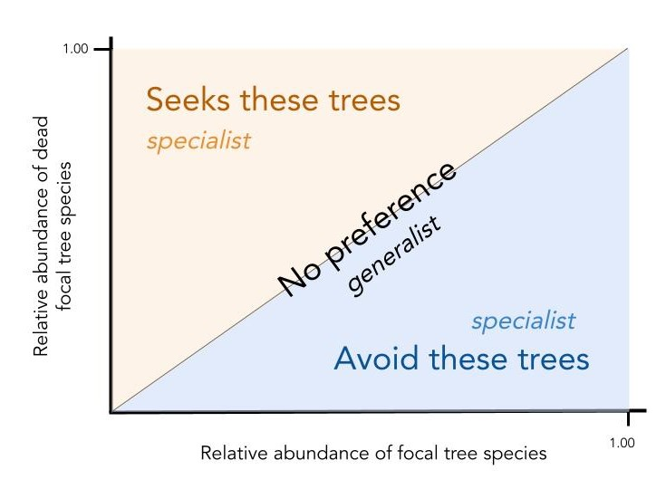

```{r, setup, include = FALSE}
library(learnr)
library(rsconnect)
knitr::opts_chunk$set(echo = TRUE)
```

---------------------------------------------------------------------------------------

## Welcome to the Living Data Tutorials

### The project

#### The Living Data Tutorials (LDTs) were developed by graduate students in ecology and evolution during the spring of 2022 as part of the Canadian Institute of Ecology and Evolution's ([CIEE])(https://www.ciee-icee.ca/data.html) Living Data Project (LDP) . Our aims were to provide free and open-access teaching material in the form of online tutorials for undergraduate students in ecology and evolution. All the tutorials make use of publicly available Canadian datasets to address specific topics in ecology and evolution. The following tutorial was built with the free and open-source software environment [R](https://www.r-project.org/) using the [leanr package](https://rstudio.github.io/learnr/). You can find the project folders and files in this [GitHub repository](https://github.com/Living-Data-Tutorials/Anticosti-Historical-Data).

The present tutorial was developed by Victoria Marie Glynn who is a PhD student at McGill University in Montréal, Québec, and Maxime Fraser Franco who is a PhD student at the Université du Québec à Montréal (UQAM) university in Montréal, Québec. Please feel free to contact us if you have any question.

Victoria Marie Glynn - victoria.glynn@mail.mcgill.ca

Maxime Fraser Franco - fraser_franco.maxime@courrier.uqam.ca

```{r, echo = FALSE, out.width = "50%", fig.align = "center", fig.cap = "Canadian Institute of Ecology and Evolution (CIEE)"}
knitr::include_graphics("images/ciee.jpeg")
```
---------------------------------------------------------------------------------------

## Learning objectives 

### By the end of this tutorial, you will be able to: 

<br>

#### 1. Interpret community ecology plots.
#### 2. Differentiate between a generalist and specialist pest species, using community ecology plots.
#### 3. Make data-driven management recommendations.

<br>

Our Anticosti Island tree dataset provides a unique opportunity for us to use **real and historical data** to gain skills in understanding what commonly made research plots, such as stacked bar plots, mean and how these figures can help us think more critically about natural resource management in Canada.

---------------------------------------------------------------------------------------

## What we will explore

When you think of predator-prey interactions, what comes to mind? Perhaps it is the emblematic hare and lynx example from the [Hudson's Bay Company pelt-trading dataset](https://jckantor.github.io/CBE30338/02.05-Hare-and-Lynx-Population-Dynamics.html), or footage from nature documentaries that showcase lions hunting zebras. But predator-prey interactions are often less conspicuous, and yet still strongly impact ecological communities. A great example are insect pests and their plant prey. In this tutorial, we are going to explore an instance of this interaction on Anticosti Island, Québec, between the hemlooper looper (*Lambdina fiscellaria*) and the trees it predates upon. 

<br>

```{r, echo = FALSE, out.width="50%", fig.align="center", fig.cap = "Map of Anticosti Island, Québec"}
knitr::include_graphics("images/anticosti_loc.png")
```
```{r, echo = FALSE, out.width = "50%", fig.align = "center", fig.cap = "Photograph of a hemlock looper larvae, Maine Forest Service, Forest Health & Monitoring, Slide Collection"}
knitr::include_graphics("images/hemlock_looper_larva.jpg")
```

<br>

### What happened on Anticosti Island in 1973?

The hemlock looper is a moth pest that is found [all across Canada](http://www.glfc.forestry.ca/VLF/ForumPresentations/heberthemlocklooper_08e.pdf), and parts of the USA, often as far south as the state of Georgia. Since 1910, it has wreaked havoc in Québec's forests. Between 1910 and 1975, these outbreaks caused an estimated [24 million cubic meters of forest to be lost](https://fr.wikipedia.org/wiki/Lambdina_fiscellaria) in the province. Since then, additional outbreaks have occurred across Québec in places like Bas-Saint-Laurent, Gaspésie, and Anticosti Island. 

Since the first outbreak, the Ministry of Forests, Wildlife and Parks of Québec ([MFFP](https://mffp.gouv.qc.ca/?lang=en)) and the Society for the Protection of Forests against Insects and Diseases ([SOPFIM](https://sopfim.qc.ca/fr/)) have been monitoring hemlock looper outbreaks. The MFFP surveyed one of the most extensive tree mortality events due to a hemlock looper outbreaks from the [period of 1971-1973](https://cfs.nrcan.gc.ca/pubwarehouse/pdfs/6856.pdf). As the hemlock looper larvae usually attacks mature tree stands by eating the leaves, it causes them to appear [yellow and red-brown in color](https://tidcf.nrcan.gc.ca/en/insects/factsheet/8846), a tell-tale sign that an outbreak has occurred. 

<br>

```{r, echo = FALSE, out.width = "50%", fig.align = "center", fig.cap = "Severely defoliated balsam fir forest due to a hemlock looper outbreak, photograph by Dr. Luc Jobin"}
knitr::include_graphics("images/balsam_looper.jpg")
```

<br>

While the outbreak was occuring, in 1973 Dr. Luc Jobin from the [Laurentian Forestry Centre](https://www.nrcan.gc.ca/science-and-data/research-centres-and-labs/forestry-research-centres/laurentian-forestry-centre/13473), and his student Michel Chabot (then going onto becoming a forester in MFFP) went to Anticosti Island to visually survey the degree of damage that the hemlock looper was causing. In their data, openly hosted on the [Government of Canada's website](https://open.canada.ca/data/en/dataset/9dda09b0-649f-4002-b207-7b204eb81cbb), they denoted a tree as either being "good," meaning it did not show any signs of damage from the outbreak, "dead" if the hemlock looper had attacked and killed the stand, and "questionable" if they were unsure. This historical, and yet still very relevant dataset, allows us to think about the impact pest outbreaks have on ecological communities.

---------------------------------------------------------------------------------------

## Tutorial objectives 

### With our Anticosti Island tree dataset, this tutorial will walk us through answering the following **four** driving questions:

<br> 

#### 1. What is the tree community composition of Anticosti Island in 1973?

#### 2. How was the tree community of Anticosti Island impacted by the hemlock looper outbreak in 1973?

#### 3. Did the hemlock looper attack specific trees because they were more abundant, or did it prefer some species regardless of their abundance?

#### 4. Based on what you find in 1-3, what management recomendations would you have for coping with hemlock looper outbreaks in Québec's forests?

<br> 

At the end of each objective, we will have a "test your knowledge!" section before moving forward, as each objective builds upon the next. 

---------------------------------------------------------------------------------------

## Setting up our R session

Let's start by loading some packages we will use for our analyses
```{r, message = FALSE, warning = FALSE}
library(data.table)
library(ggplot2)
library(dplyr)
```

Then, we import the data in the current R session
```{r, message = FALSE, warning = FALSE}
# Tree condition data url paths
url_tree <- "https://open.canada.ca/data/en/dataset/9dda09b0-649f-4002-b207-7b204eb81cbb/resource/a1606235-95aa-4c81-a8db-19b852be288c"
csv_tree <- "download/anticosti_1973_trees.csv"

# Import the data and keep the columns we need
tree <- fread(file.path(url_tree, csv_tree),
              select = c("Block", "Compartment", "Plot",
                         "Cell", "Species", "Species_abbrev",
                         "Condition", "Number"))

# Separate row number as individual instances to have all individual tree counts
tree <- tree[rep(seq(.N), Number)]
tree[, Number := 1]

# Change "Larch" to "American larch"
tree$Species <- gsub("Larch", "American larch", tree$Species)

```

---------------------------------------------------------------------------------------

## Tutorial objective 1

### Describing Anticosti Island's tree community composition

#### We will first gain an overview of the tree species that were identified during the outbreak. To do so, we are going to plot the tree species using a boxplot. This will enable us to evaluate their distribution on Anticosti Island.

We will first make some preparations for our boxplot to look nice:
```{r, warnings = FALSE}
# First, we arrange a table to plot our tree species abundances

# a. Compute the species richness by Cell
tree[, species_richness := length(Species),
     by = .(Cell, Plot, Compartment, Block)]

# b. Keep only unique rows
# We filter out the "Condition" column to ensure that rows are unique
boxplot_tab <- unique(tree[, !"Condition"])


# We then prepare a custom theme to have a nice plot
custom_theme <- theme(# axis values size
                      axis.text.x = element_text(face = "plain", 
                                                 size = 12,
                                                 color = "black"),
                      axis.text.y = element_text(face = "plain", 
                                                 size = 12,
                                                 color = "black"),
                      # axis ticks lenght
                      axis.ticks.length = unit(.15, "cm"),
                      # axis ticks width
                      axis.ticks = element_line(size = 0.90, 
                                                color = "black"),
                      # axis titles size
                      axis.title = element_text(size = 15, 
                                                face = "plain"),
                      plot.title = element_text(size = 17, 
                                           face = "plain"),
                      axis.line = element_line(size = 0.95),
                      #legend.position = "none",
                      panel.grid = element_blank(),
                      panel.background = element_blank())
```

Now we can visualize our boxplot:
```{r, warnings = FALSE, message = FALSE, fig.width = 8, fig.height = 8}
ggplot(boxplot_tab,
       aes(x = Species,
           y = species_richness)) +
  geom_boxplot(fill = "light green",
               color = "black",
               outlier.shape = NA) +
  geom_jitter(shape = 16,
              alpha = 0.3,
              position = position_jitter(0.3)) +
  xlab("Tree specie\n") +
  ylab("\nNumber of individuals") +
  scale_y_continuous(breaks = seq(0, 30, 5)) +
  custom_theme +
  coord_flip()
```

#### From this boxplot, we see that seven different tree species were identified, with their respective abbreviation from the dataset shown in parentheses:

#### 1. White birch (BOP) - *Betula papyrifera*
#### 2. White spruce (EPB) - *Picea glauca*
#### 3. Black spruce (EPN) - *Picea mariana*
#### 4. American larch (Meleze) - *Larix laricina*
#### 5. Aspen spp. (Peuplier) - *Populus* spp.
#### 6. Pine spp. (Pin) - *Pinus* spp.
#### 7. Balsam fir (SAB) - *Abies balsamea*

<br> 

```{r, echo=FALSE, out.width="80%", fig.align="center", fig.cap="Tree species that were sampled on Anticosti Island"}
knitr::include_graphics("images/Tree_Anticosti.png")
```

<br>

### Let's test our knowledge!

#### From looking at the boxplot: 

```{r checkbox-a, echo = FALSE}
question("What tree species is the **MOST** abundant in the data?",
  answer("White birch (BOP) - *Betula papyrifera*"),
  answer("White spruce (EPB) - *Picea glauca*"),
  answer("Black spruce (EPN) - *Picea mariana*"),
  answer("American Larch (Meleze) - *Larix laricina*"),
  answer("Aspen (Peuplier) - *Populus* spp."),
  answer("Pine (Pin) - *Pinus* spp."),
  answer("Balsam fir (SAB) - *Abies balsamea*", correct = TRUE)
)
```

```{r checkbox-b, echo = FALSE}
question("What tree species is the **LEAST** abundant in the data?",
  answer("White birch (BOP) - *Betula papyrifera*"),
  answer("White spruce (EPB) - *Picea glauca*"),
  answer("Black spruce (EPN) - *Picea mariana*"),
  answer("American Larch (Meleze) - *Larix laricina*", correct = TRUE),
  answer("Aspen (Peuplier) - *Populus* spp."),
  answer("Pine (Pin) - *Pinus* spp."),
  answer("Balsam fir (SAB) - *Abies balsamea*")
)
```

---------------------------------------------------------------------------------------

## Tutorial objective 2

### How was the tree community of Anticosti Island impacted by the hemlock looper?

#### Here, the scientists who sampled the individual trees assigned a damage state to each one of them. They assigned one of the three following states : "Good", "Dead," or "Questionable".

To investigate the differences in damage among the tree species, we will first need to calculate the proportion of observed damage states per tree species:
```{r, message = FALSE, warning = FALSE}
tree_damage <- tree %>%
  group_by(Species, Condition) %>%
  summarise(n = n()) %>%
  mutate(freq = n / sum(n))
```

We can then plot this with the following commands:
```{r, message = FALSE, warning = FALSE, fig.width = 9, fig.height = 6}
ggplot(tree_damage,
       aes(y = freq,
           x = Species,
           fill = Condition)) + 
  geom_bar(position = "stack",
           stat = "identity",
           color = "black") +
  scale_fill_manual(values = c("plum", "light green", "khaki1")) +
  ggtitle("Relative damage for each tree species") +
  xlab("Tree specie\n") +
  ylab ("\nProportion of damage") +
  custom_theme +
  coord_flip()
```

### Let's test our knowledge!

#### From looking at this plot:

```{r checkbox-c, echo = FALSE}
question("What tree species was **MOST** affected by the hemlock looper? Select all that apply.",
  answer("White birch (BOP) - *Betula papyrifera*"),
  answer("White spruce (EPB) - *Picea glauca*"),
  answer("Black spruce (EPN) - *Picea mariana*"),
  answer("American larch (Meleze) - *Larix laricina*."),
  answer("Aspen spp. (Peuplier) - *Populus* spp."),
  answer("Pine spp. (Pin) - *Pinus* spp."),
  answer("Balsam fir (SAB) - *Abies balsamea*", correct = TRUE)
)
```

```{r checkbox-d, echo = FALSE}
question("What tree species was **LEAST** affected by the hemlock looper? Select all that apply.",
  answer("White birch (BOP) - *Betula papyrifera*"),
  answer("White spruce (EPB) - *Picea glauca*"),
  answer("Black spruce (EPN) - *Picea mariana*"),
  answer("American larch (Meleze) - *Larix laricina*", correct = TRUE),
  answer("Aspen spp. (Peuplier) - *Populus* spp.", correct = TRUE),
  answer("Pine spp. (Pin) - *Pinus* spp.", correct = TRUE),
  answer("Balsam fir (SAB) - *Abies balsamea*")
)
```

### What can we deduce in light of these results?

#### The two previous plots beg the following question: were hemlock loopers attacking Balsam firs (SAB) because were more abundant on Anticosti Island, or because this is their preferred prey? In other words, is this a **generalist** or **specialist** predator pest species? 

<br>

#### Let us break this idea down: 

<br> 

#### - A species is a **generalist** if it can live in a variety of environments and eat a variety of foods, meaning it is quite flexible in its diet and habitat requirements. 
#### - A species is a **specialist** if it has a limited diet, and stricter habitat requirements, meaning it cannot live anywhere and cannot eat anything. 

#### Two great examples are pigeons and koalas -- pigeons live in a diversity of urban environments and are omnivores (eat plant and animal matter), while koalas only live on and eat eucalyptus.

<br> 

```{r, echo = FALSE, out.width = "70%", fig.align = "center", fig.cap = "Example of a specialist and generalist species"}
knitr::include_graphics("images/specialist_generalists.png")
```

### With this in mind, let us continue our investigation to gain some further insights:

---------------------------------------------------------------------------------------

## Tutorial objective 3

### Is there a relationship between the abundance of tree species and the ones the hemlock looper attacks?

#### This question asks us to consider the role of relative abundance in pest prevalence. Below is a comic to convey this idea.

#### Imagine you are a hemlock looper about to lay its eggs. Wouldn't it be most convenient to lay them on the first tree you find? In this case, the more abundant a tree is, the more likely it is to be predated upon. 

#### Alternatively, perhaps hemlock loopers prefer a particular tree species because it has more tender leaves. In this case, even if this species was more rare in the forest, we would notice it has more hemlock looper damage than we would expect based on its relative abundance.

```{r, echo = FALSE, out.width = "70%", fig.align = "center", fig.cap = "Comic on the role of relative abundance and pest prevalence, by Victoria Marie Glynn"}

```

<br> 

#### We thus need to consider the **relative abundance** (%) of a given tree species, our x-axis or independent variable, as it relates to the relative prevalence (%) of trees that were denoted as "dead," our y-axis or dependent variable, which is proxy for predation pressure.

<br> 

#### With this in mind, we can create the following schematic to predict three possible scenarios:

```{r, echo = FALSE, out.width = "80%", fig.align = "center", fig.cap = "Three possible scenarios regarding the hemlock loopers' predation behavior"}

```

<br> 

#### (1) The hemlock looper has no preference on what tree it predates upon -- it is a **generalist** pest species. 

##### → We would see this on our graph as a **one-to-one relationship** (diagonal black line), where a tree species' abundance in the forest is directly proportional to the number of trees from that species denoted as "dead." This means that the more the trees, the more the hemlock looper eats it.

#### (2) The hemlock looper prefers to predate upon some species versus others -- it is a **specialist** pest species. 

##### → We would see this on our graph if a tree species' points lie **above the one-to-one line** (orange triangle), as this means that the hemlock looper kills more trees of a given species (tree denoted as "dead") even if the relative abundance of this tree specie is lower.

#### (3) The hemlock looper avoids some species, and thus these are less predated upon -- it is a **specialist** pest species. 

##### → We would see this on our graph if a species' points lie **below the one-to-one line** (blue triangle), as this means that less individuals of a given tree species are killed by the hemlock looper even if their abundance relative to other species is higher.

<br> 

### Let's plot our actual data and see where the results lie, in relationship to our guiding schematic above.

<br> 

We'll start by filtering out the "Questionable" tree status to answer our question, and calculate the total abundance of tree species by cell, either dead or alive. With this, we'll be able to calculate the abundance of a focal specie relative to the abundance of all species within a cell.
```{r}

# Filter out "Questionable individuals"
tree_filter <- tree[Condition != "Questionable",
                    .(Cell, Species, Condition, Number)]

# Calculate number of individuals by species for each cell
tree_filter[, sp_ind_by_cell := sum(Number), by = .(Species, Cell)]

# Calculate number of individuals by species for each cell relative to other species
tree_filter[, sum_ind_sp_cell := sum(unique(sp_ind_by_cell)), by = Cell]
tree_filter[, prop_ind_sp_cell := sp_ind_by_cell / sum_ind_sp_cell, by = Cell]

```

We then evaluate the count of a tree specie's deaths relative to all dead species within a cell:
```{r}

# Calculate total "Dead" by Cell
tree_filter[Condition == "Dead", total_dead := length(Condition), by = Cell]

# Calculate proportion of dead species over all deaths by cell
tree_filter[Condition == "Dead", total_dead_sp_cell := length(Condition), by = .(Species, Cell)]
tree_filter[Condition == "Dead", prop_dead := total_dead_sp_cell / total_dead, by = .(Species, Cell)]

# Keep unique values with only "Dead" rows and use this table for plotting
tree_filter <- unique(tree_filter[Condition == "Dead",])
```

We make some final adjustments to the data to filter out only what we need:
```{r}

# Filter out Aspen and Pine because we only have two observations
species <- c("Balsam fir", "Black spruce", "White spruce")
tree_filter <- tree_filter[Species %in% species]

# Filter cells with only with 1 species found dead
tree_filter[, unique_dead := length(unique(Species)), by = Cell]
tree_filter <- tree_filter[unique_dead != 1]

```

We finish by plotting the relationship between the two:
```{r fig.width = 8.5, fig.height = 6}
ggplot(tree_filter,
       aes(x = prop_ind_sp_cell,
           y = prop_dead,
           colour = Species)) +
  geom_abline(intercept = 0,
              slope = 1,
              size = 0.8,
              linetype = "dashed") +
  geom_point(size = 4,
             shape = 21,
             aes(fill = Species)) +
  scale_colour_manual(values = c("black","black", "black")) +
  scale_fill_manual(values = c("darkgreen", "chartreuse4", "green3")) + # chartreuse
  ylab("Abundance of dead trees relative to all dead trees\n") +
  xlab("\nRelative abundance of focal tree species") +
  scale_y_continuous(breaks = seq(0, 1, .25),
                     limits = c(0,1)) +
  scale_x_continuous(breaks = seq(0, 1, .25),
                     limits = c(0,1)) +
  custom_theme

```

### Let's test our knowledge!

**From the graph and  based on our predictions above, we can now answer the question:**
```{r letterx-d, echo = FALSE}
question("Do hemlock loopers preferentially attack a given tree species?",
  answer("**Yes**, hemlock loopers preferentially attack **balsam fir trees** because there are proportionally more dead trees of this species relative to their overall abundance in the forest", correct = TRUE),
  answer("**Yes**, hemlock loopers preferentially attack **white spruce trees** because there are proportionally less dead trees of this species relative to their overall abundance in the forest"),
  answer("**No**, the relative abundance of dead trees for each species is directly proportional to their overall abundance in the forest"),
  answer("I am not sure, I would need more data")
)
```

---------------------------------------------------------------------------------------

## Tutorial objective 4

### What do our findings imply in terms of pest management on Anticosti Island?

This dataset represents one of the many hemlock looper outbreaks Anticosti Island, and Québec as a whole, has experienced. Based on your findings, please reflect and respond to the following questions. To help inform your answers, please refer to the following helpful links about hemlock looper:

- [Hemlock looper overview](https://www.plantwise.org/knowledgebank/datasheet/29749)
- [Biological control of the hemlock looper](https://www.plantwise.org/KnowledgeBank/pestalert?pan=19740515762)
- [Hemlock looper life history, management considerations](https://www.fs.usda.gov/Internet/FSE_DOCUMENTS/stelprdb5191788.pdf)

### "Big-picture" questions

#### 1. What trees would you most closely monitor?

#### 2. What additional protections/restrictions should exist on Anticosti Island?

#### 3. What management suggestions would you provide to the MFPP?

<br> 

**As our Anticosti Island tree dataset underscores, historical data is a powerful tool to help us best contextualize current management concerns, and assist us in making data-driven decisions.**

---------------------------------------------------------------------------------------

## References

*Images*
<br>
- [Map of Anticosti Island, Québec](https://en.wikipedia.org/wiki/Anticosti_Island#/media/File:Canada_Quebec_location_map_2.svg)
<br>
- [Photograph of a hemlock looper](https://www.maine.gov/dacf/mfs/forest_health/insects/hemlock_looper.htm)
<br>
- [Photograph of severely defoliated balsam fir forest](https://tidcf.nrcan.gc.ca/en/insects/factsheet/8846?wbdisable=true)
<br>
- [Photograph of a white birch](https://www.flickr.com/photos/bryanto/6190721247)
<br>
- [Photograph of a white spruce](https://commons.wikimedia.org/wiki/File:Picea_glauca_Fairbanks.jpg)
<br>
- [Photograph of a black spruce](https://commons.wikimedia.org/wiki/File:Picea_mariana_(Spruce_black).jpg)
<br>
- [Photograph of a larch](https://en.wikipedia.org/wiki/Larch#/media/File:SubalpineLarch_7735tl.jpg)
<br>
- [Photograph of an aspen](https://www.flickr.com/photos/dianasch/23567442848)
<br>
- [Photograph of a pine](https://commons.wikimedia.org/wiki/File:Pinus_ponderosa_15932.JPG)
<br>
- [Photograph of a balsam fir](https://commons.wikimedia.org/wiki/File:Abies_balsamea_0165.jpg)
<br>
- [Photograph of a pigeon](https://www.piqsels.com/en/public-domain-photo-oyrzq)
<br>
- [Photograph of a koala](https://pixabay.com/photos/koala-animal-eucalyptus-wildlife-6094650/)
<br>

*Further reading*
<br>
- [The impact of hemlock looper (*Lambdina fiscellaria fiscellaria* (Guen.)) on balsam fir and spruce in New Brunswick, Canada](https://www.sciencedirect.com/science/article/abs/pii/S0378112798005271?casa_token=pZW2ZnLwB0YAAAAA:bJHXx-f-cIU7UOPzxfe9Swj5OD9Gfm6bs3AM0ZK7IekzDOUzOdmayh9z62VAO6gV3Sjy8VVcMw#FIG2)
<br>
- [Hemlock Looper, Overview of the last 15 years - Presentation by Christian Hébert during the Pest Forum – 2 December, 2008](http://www.glfc.forestry.ca/VLF/ForumPresentations/heberthemlocklooper_08e.pdf)
<br>
- [Early succession of bark and wood boring beetles during an outbreak of the hemlock looper (*Lambdina fiscellaria* (Guenée)) (Lepidoptera: Geometridae) in boreal balsam fir forest](https://corpus.ulaval.ca/jspui/bitstream/20.500.11794/27571/1/33338.pdf#page=54)
<br>
- [Early responses of bark and wood boring beetles to an outbreak of the hemlock looper *Lambdina fiscellaria* (Guenée) (Lepidoptera: Geometridae) in a boreal balsam fir forest of North America](https://resjournals.onlinelibrary.wiley.com/doi/abs/10.1111/afe.12347)
<br>
- [Extreme cold weather causes the collapse of a population of *Lambdina fiscellaria* (Lepidoptera: Geometridae) in the Laurentian Mountains of Québec, Canada](https://www.cambridge.org/core/journals/canadian-entomologist/article/abs/extreme-cold-weather-causes-the-collapse-of-a-population-of-lambdina-fiscellaria-lepidoptera-geometridae-in-the-laurentian-mountains-of-quebec-canada/4D36CE7C818EF7D75D8E5C7B7F75DA0F)
<br> 
-[Capability of ERTS-1 imagery for mapping forest cover types of Anticosti Island](https://pubs.cif-ifc.org/doi/pdf/10.5558/tfc50233-6)
